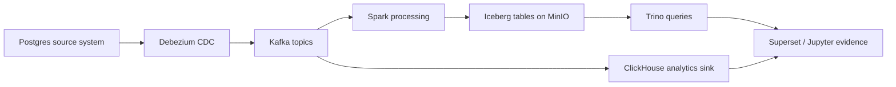

# Data Forge Portfolio Case Study

## Status

This repository is a fork used as a portfolio lab for modern Data Engineering workflows. The base stack comes from the upstream project; this fork is intended to become a reproducible applied case study with explicit contribution notes, validation queries, and run evidence.

## Target Scenario

**Retail CDC to lakehouse and analytics.**

The applied case will model a small retail system where operational changes are captured from Postgres, streamed through Kafka/Debezium, landed into lakehouse storage, and queried through analytical engines.

## Planned My Contribution

- Document a reproducible end-to-end retail CDC runbook.
- Add validation queries for row counts, duplicate keys, schema drift, and CDC replay sanity.
- Add sample Trino and ClickHouse queries with expected results.
- Capture screenshots or logs proving that the local stack ran successfully.
- Keep the README honest about fork origin and scope of changes.

## Acceptance Criteria

- A reviewer can run one local scenario with Docker Compose.
- The case study explains what changed in this fork versus upstream.
- The repo includes evidence of ingestion, transformation, analytical query output, and data quality checks.
- The project is presented as a learning lab unless/until the fork has substantial original code.

## Next Backlog

1. Add a `docs/retail-cdc-runbook.md` with exact commands and expected service URLs.
2. Add `sql/validation/` queries for bronze row counts and CDC operation coverage.
3. Add `sql/examples/` queries for Trino and ClickHouse.
4. Add screenshots under `docs/assets/` after browser verification.
5. Add a concise `My contribution` section to the root README after the first full run.
