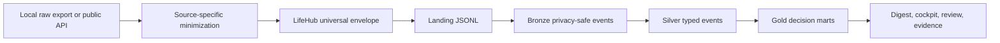

# LifeHub Privacy Model

LifeHub treats personal data as local-first product data. The default design is to keep raw exports on the user machine, land only minimized envelopes, and publish only synthetic fixtures or aggregate evidence.

## Principles

- Local first: real personal exports, secrets, and raw device files stay outside git and outside public evidence.
- Minimize before landing: landing JSONL should already be safe enough for local Bronze ingestion.
- Separate raw from analytical truth: Bronze stores privacy-safe envelopes, not unrestricted raw exports.
- Tier by harm: source tier controls what can be collected, landed, documented, and shown in evidence.
- Prefer buckets over identifiers: use coarse categories, date buckets, amount buckets, place buckets, contact buckets, and local pointer ids.
- Evidence is operational: public evidence can show counts, freshness, schema presence, and quality checks, not raw personal records.

## Privacy Classes

| Privacy Class | Allowed | Forbidden |
| --- | --- | --- |
| `public_context` | Public API facts, open-source activity summaries, market/context snapshots, synthetic examples. | User identifiers, private repo payloads, credentials. |
| `derived_context` | Scores, daily profiles, weekly aggregates, recommendation summaries. | Raw diary rows, private addresses, chat ids, free-text notes. |
| `private_behavior_summary` | Activity, task, app-use, preference, and feedback buckets. | Raw notes, task titles, URLs, search queries, client names. |
| `private_location_summary` | Route metrics, coarse place buckets, dwell/commute summaries. | Exact private coordinates, home/work addresses, raw GPS history. |
| `private_health_summary` | Sleep, recovery, biometric, nutrition, and medication summaries. | Raw health exports, device identifiers, clinical free text. |
| `private_finance_summary` | Category totals, amount buckets, account buckets, budget signals. | Account numbers, merchant strings, transaction memos, raw statements. |
| `private_communications_summary` | Interaction counts by channel, direction, and contact bucket. | Message bodies, subjects, emails, phone numbers, chat ids, contact names. |
| `private_identity_document` | Pointer-only document bucket, lifecycle status, expiry month, reminder date. | Scans, document numbers, legal text, irreversible identifiers. |
| `secret_credential` | Pointer-only rotation metadata and age buckets. | Secret values, token names, usernames, URLs, vault exports, private keys. |

## Data Flow

Tier 1 sources may start from public APIs or synthetic fixtures. Tier 2 and Tier 3 sources start from local raw exports but must be minimized before landing. Tier 4 sources should not write raw payloads to shared Bronze at all; they may write pointer-only metadata after explicit opt-in.

## Raw And Local Policies

`public_fixture_ok`: committed fixtures are allowed only when payloads are synthetic or public-safe.

`local_raw_only`: raw exports remain on ignored local paths. Connectors transform them into redacted summaries before landing.

`summarized_landing_only`: landing JSONL contains only summary metrics, buckets, derived facts, or redacted source rows.

`no_shared_bronze_raw`: the shared Bronze table must not receive raw records for this source. Use pointer metadata or derived reminders only.

`secrets_forbidden`: credentials, tokens, passwords, cookies, private keys, API keys, chat ids, and vault exports are not valid LifeHub event payloads.

## Evidence Rules

Allowed in committed docs and evidence:

- Source-level counts.
- Schema names and required fields.
- Freshness status.
- Quality check pass/fail status.
- Aggregate metrics and redacted examples.

Forbidden in committed docs and evidence:

- Telegram tokens, chat ids, cookies, API keys, private keys, passwords, and secret values.
- Raw diary notes, pain text, task titles, message bodies, email addresses, phone numbers, and contact names.
- Home/work addresses, raw GPS history, exact private coordinates, document numbers, scans, legal text, account numbers, merchant strings, and transaction memos.

## Connector Review Checklist

1. The source is registered with tier, privacy class, raw policy, local policy, commit policy, consumers, and onboarding contract.
2. The payload can be expressed in the universal event envelope without direct identifiers.
3. Idempotency keys are deterministic and non-secret.
4. Synthetic fixtures do not resemble real secrets, addresses, financial records, health exports, message bodies, or legal documents.
5. Tier 2 and Tier 3 connectors have source-specific redaction tests before landing.
6. Tier 4 connectors are pointer-only and require explicit opt-in before any local index is created.
7. Public evidence contains only operational proof and aggregate status.

## Current Scope Boundary

This privacy model describes the source architecture contract. It does not require implementing every planned connector immediately. The active fixture path remains synthetic, and the existing LifeHub MVP continues to use local-only privacy-safe data products.
